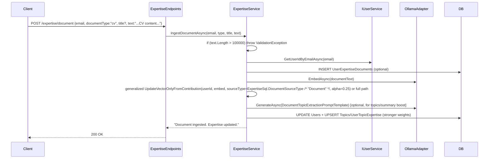
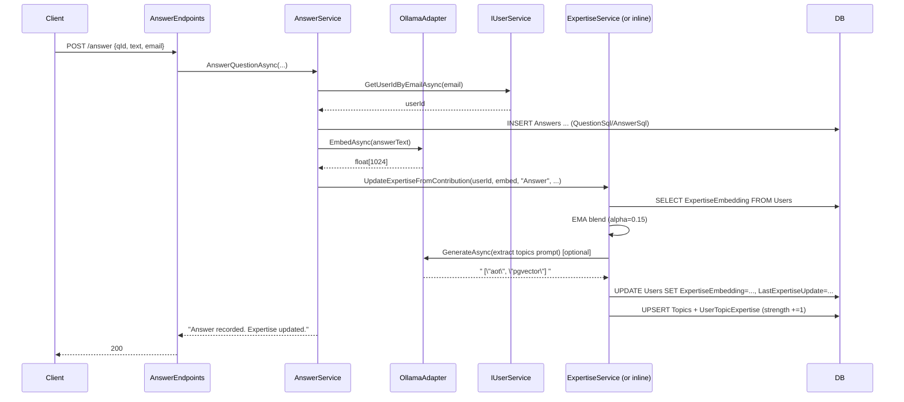

# User Expertise System for Mentekus (with Optional Text Document Ingestion Enhancement)

**DESIGN_ID**: 1f7bf5b0  
**Author**: Grok (Systems Architect)  
**Date**: 2026-06-14  
**Status**: Draft (Enhancement: Optional Text Document Ingestion)

## Overview

The User Expertise System automatically constructs and maintains dynamic person profiles and an expertise graph derived solely from user contributions (initially questions asked and answers provided). This replaces the current indirect "past asker" signal (via question similarity) with direct, accurate expert routing for new questions.

The solution extends the existing minimal .NET 10 Native AOT stack (Dapper.AOT, pgvector, Ollama embeddings via `OllamaAdapter`, DbUp migrations, `[EndpointGroup]` source-gen, Injectio `[RegisterScoped]`, explicit `*Sql.cs` patterns) by:

- Introducing an `Answer` contribution type as a strong expertise signal (complementing the weaker "asked" signal).
- Blending contribution embeddings into `User.ExpertiseEmbedding` (VECTOR(1024)) using exponential moving average (EMA) with differentiated weights.
- Persisting a lightweight expertise graph using normalized `Topics` + `UserTopicExpertise` tables (no external graph DB).
- Adding synchronous profile enrichment (vector + optional LLM-generated summary/topics via the existing `qwen3:4b-instruct` model).
- Exposing new endpoints for answering, profile management, and expert routing (`/expertise/route`), while respecting the pre-existing (but unused) `ProfileVisible`/`AllowRouting` flags on `User`.
- Keeping all computation request-synchronous, AOT-compatible, and following existing conventions in `Mentekus.Api/Features/*`, `Shared/Database/Migrations/`, etc.

**Enhancement (this revision)**: Add an optional self-serve "Profile Document" / "Document" contribution type. Users may POST a text-only document (e.g., the content of a CV or a short paragraph describing their position at the organisation) after account creation or at any time. This text string is provided directly in JSON (no multipart/form-data or binary in v1; aligns with existing pure-JSON `QuestionAskRequest` style in `Mentekus.Api/Features/Question/Requests/QuestionAskRequest.cs:4-6` and `AppJsonSerializerContext.cs`). The ingested text feeds the *exact same* vector blending (`ExpertiseEmbedding` via generalized `BlendExpertiseVector` / `UpdateVectorOnlyFromContributionAsync`), graph (`Topics`/`UserTopicExpertise`), and summary machinery as Answers/Questions, but with differentiated high-signal treatment (alpha ~0.25, specialized LLM extraction prompt focused on professional skills/domains/technologies/role context, stronger influence on `ExpertiseSummary`). A small new `UserExpertiseDocuments` table optionally persists the source text (enforcing a 100k char cap with `ValidationException`) for audit/re-ingest. Documents require no linked Question. This provides faster, more accurate profile bootstrapping than waiting for organic answer contributions alone.

This enables production-grade routing such as "find the top 5 experts for this new question text" with confidence scores, topic overlap explanations, and recency/activity signals. Document ingestion can deliver immediate value for seeding even before many answers exist.

## Background & Motivation

Current state (verified via codebase exploration):

- `User` entity (`Mentekus.Api/Features/User/Entities/User.cs:5-15`) and migration `0002_UsersAndLinkQuestion.sql:1-13` include `ProfileVisible`, `AllowRouting`, and `ExpertiseEmbedding VECTOR(1024)`. Migration `0002` also adds `AskedByUserId` (UUID REFERENCES) to the Questions table (and corresponding property on the Question entity). These User profile/expertise columns and the link are **dead code**: no updates, no reads in business logic, no endpoints beyond basic add (verified in UserService/UserSql/UserEndpoints and Question flows).
- `UserService` (`Mentekus.Api/Features/User/UserService.cs:9-23`) and `UserSql.cs` only implement `GetUserIdByEmailAsync` + `AddUserAsync` (insert lacks the profile columns; uses DB defaults).
- `UserEndpoints.cs:15` only exposes `POST /user/add`.
- `QuestionService.AskAsync` (`Mentekus.Api/Features/Question/QuestionService.cs:17-40`) embeds via `OllamaAdapter.EmbedAsync` (line 24) and stores in `Questions` with `AskedByUserId`, **but performs zero expertise updates**.
- `GetSimilarQuestionsAsync` + `QuestionSql.FindSimilarQuestions:10-17` joins to surface `AskedByUserId`/`AskedByEmail` via question-to-question cosine similarity (`1 - (q.Embedding <=> @Vector)`). This is the *only* current "routing" mechanism and is indirect/weak (askers of similar questions, not proven experts).
- No `Answer`, `Contribution`, `Topic`, or graph tables exist. Migrations stop at `0003_UseCitextForEmail.sql`.
- `OllamaAdapter.cs:9-28` only supports embeddings (model from `OllamaOptions.EmbeddingModel = "qwen3-embedding:0.6b"`; `VECTOR(1024)` matches the model's default dim per HF/ollama specs). The instruct model `qwen3:4b-instruct` is pulled and configured in `compose.yaml:10` + `appsettings.json:14` but unused in code.
- All patterns are explicit/minimal: static `*Sql.cs` const strings, primary-ctor services with `[RegisterScoped]`, `AppJsonSerializerContext` source-gen for AOT (no reflection), `IDbConnection` per-request, DbUp embedded scripts.
- Tests (`Mentekus.Api.Tests/Integration/QuestionEndpointsTests.cs`, `UserEndpointsTests.cs`, `IntegrationTestBase.cs`, `TestWebApplicationFactory.cs`) mock `IOllamaAdapter` and use `pgvector/pgvector:pg17` Testcontainers. `OllamaAdapterTests.cs` covers the HTTP path.
- Confirmed: zero file/multipart/IFormFile support anywhere in C# (grep for IFormFile|multipart|FormFile returned only JSON Content-Type in `.http` files and Ollama sh; all endpoints use `PostAsJsonAsync` + records; no `HttpContext.Request.Form` or binary paths). Requests always pure JSON per `AppJsonSerializerContext.cs` and endpoint handlers (e.g. `QuestionEndpoints.cs:18-24`).
- The live User entity also declares an unused `ExternalId` (string?) property with no corresponding column or usage in current migrations (0002) or inserts (UserSql.cs); this pre-dates the expertise work and is orthogonal.

**Coding Conventions Observed in This Codebase** (for implementers; derived from live code and prior design):
- Feature folders under `Mentekus.Api/Features/*` (e.g. Question/, User/; new Answer/ and Expertise/ will follow).
- All request/response/row records co-located in per-feature `Features/XXX/Requests/` (see QuestionSimilarityResponse in QuestionSimilarityRequest.cs; UserAddResponse in UserAddRequest.cs).
- Explicit `*Sql.cs` static classes with raw `"""` string consts for all queries (exact formatting in QuestionSql.cs, UserSql.cs).
- Services: primary-ctor DI + `[RegisterScoped(ServiceType = typeof(IXXX))]` (QuestionService.cs:11-15, UserService.cs, OllamaAdapter.cs); no manual registration beyond the attribute (Injectio + `AddMentekusApi()`).
- Endpoints: `[EndpointGroup]` static class with `public static void MapEndpoints(IEndpointRouteBuilder)`, `using Mentekus.Api.Generated;`, private static `Handle*Async` returning `Task<Ok<T>>` + `TypedResults` (exact in QuestionEndpoints.cs:7-34, UserEndpoints.cs).
- AOT: *all* new serializable types added to `AppJsonSerializerContext.cs` immediately (with `[JsonSerializable]`); verify via `dotnet publish -c Release`.
- Error patterns: reuse `ValidationException(propertyName, msg)`, `NotFoundException(name, key)`, `EmbeddingFailedException`; mapped in GlobalExceptionHandler.
- Migrations: idempotent `CREATE ... IF NOT EXISTS`, `ADD COLUMN IF NOT EXISTS`; embedded via csproj + DbUp in DatabaseExtensions.
- Tests: real PG via Testcontainers + pgvector image; mock only Ollama via factory override; PostAsJsonAsync + ReadFromJsonAsync with context.Default.

**Pain points**:
- "Who knows what?" is unanswerable. Questions accumulate but yield no actionable expertise model.
- `ExpertiseEmbedding` is placeholder/dead.
- No notion of answers (stronger signal than asking per domain knowledge).
- No topics/graph for transitive or "experts in X similar to Y" queries.
- Current similarity surfaces *askers*, not *answerers*.
- New: bootstrapping is slow and sparse for new users or low-activity users. Even after account creation via `POST /user/add`, there is no way for a user to explicitly seed accurate professional context (e.g. "I am a Senior .NET engineer at Acme Corp working on AOT and pgvector") without waiting for them to answer questions organically. Self-provided high-signal documents (CV text or position paragraph) solve this directly while still routing through the exact same auto vector/graph/summary pipeline.

The change is required to deliver the core product promise of "accurate routing of questions to the right people" purely from contributions (no manual tagging). The optional document ingestion is a natural, high-value additive that accelerates profile quality without altering the hybrid query or contribution model invariants.

## Goals & Non-Goals

**Goals**:
- Automatically evolve `User.ExpertiseEmbedding` (and richer profile data) from contributions.
- Define and persist "contributions" (Answers as primary + Questions as secondary; **Document/ProfileDocument as optional high-signal explicit seed**; extensible).
- Build/maintain an expertise graph (topics + user-topic strength edges) in Postgres.
- Implement reliable routing: embed question → cosine similarity against user expertise vectors + graph/activity boosts + flag filters → ranked experts + confidence.
- Follow all existing architecture patterns exactly (feature folders, explicit SQL, AOT-safe serialization, synchronous on-demand embeddings, DbUp migrations per established codebase conventions documented above).
- Support evolution/decay of expertise over time.
- Provide opt-in/out and visibility controls via existing flags.
- Bootstrap naturally (new contributions build profiles; pre-existing users start sparse); **explicitly support faster self-serve seeding via optional text documents (CV/position) post-account-creation or anytime**.
- Add required endpoints/services while updating serialization, tests, and error handling consistently.
- Quantified targets (dev scale initially): routing p95 < 250ms (2-3 embeds + optional generate), <10k users/100k contribs expected in early phases, storage ~4-8 KB/row for vectors + small topic tables; document table adds negligible per-user overhead (one or few rows, text capped).
- **For document enhancement**: treat self-provided documents as high-weight explicit contributions processed through the *same* auto pipeline (vector + graph + summary); enforce text-only JSON input + 100k char cap + ownership; never surface raw document text.

**Non-Goals**:
- Manual profile editing or self-tagging UI/endpoints (auto-only).
- Background workers, queues, or outbox patterns (keep request-synchronous unless latency forces change; justify any addition).
- Dedicated graph database (Neo4j etc.) or external services.
- Full auth/identity (emails remain primary identifier; citext uniqueness as-is).
- Multi-vector per user or dimension reduction beyond current 1024.
- Historical versioning/audit log of every expertise delta in v1 (simple `LastExpertiseUpdate` sufficient).
- Automatic backfill of expertise for legacy questions (document as future or admin script).
- Changing existing `/question/similarity` behavior (keep as "similar past questions").
- Streaming LLM responses or complex RAG.
- Feature flags library (use simple config or code conditionals for staged rollout).
- Down-migrations (DbUp forward-only as current).
- **PDF/binary parsing, full file upload (multipart/IFormFile), image handling, or document RAG/versioning/retention beyond the small optional source table in v1**. Text content is supplied by the caller (e.g. client extracts from their CV file); no server-side file ingestion or storage of binaries.
- Complex chunking/summarization of very long documents in v1 (simple cap + full-text prompt for extraction; see Open Questions).

## Proposed Design

### High-Level Architecture

```mermaid
flowchart TB
    subgraph Client
        C[Client / .http / Scalar]
    end

    subgraph API
        UE[UserEndpoints.cs] -->|flags + profile| US[IUserService]
        AE[AnswerEndpoints.cs NEW] --> AS[AnswerService NEW]
        EE[ExpertiseEndpoints.cs NEW] --> ES[ExpertiseService NEW]
        QE[QuestionEndpoints.cs] --> QS[QuestionService]
        
        AS --> OA[OllamaAdapter]
        ES --> OA
        QS --> OA
        
        AS --> US
        ES --> US
        QS --> US
        
        AS --> DB[(IDbConnection)]
        ES --> DB
        US --> DB
        QS --> DB

        C -->|POST /expertise/document {email, documentType, text}| EE
        EE -->|IngestDocumentAsync + embed + persist optional + generalized update| ES
    end

    subgraph Postgres
        DB --> Users[(Users<br/>+ ExpertiseEmbedding<br/>+ ExpertiseSummary<br/>+ flags)]
        DB --> Questions[(Questions + AskedByUserId)]
        DB --> Answers[(Answers NEW<br/>QuestionId + AnsweredByUserId)]
        DB --> Topics[(Topics NEW)]
        DB --> UTE[(UserTopicExpertise NEW<br/>strength edges)]
        DB --> UED[(UserExpertiseDocuments NEW<br/>optional source text for Documents)]
    end

    subgraph External
        OA -->|POST /api/embed| Ollama[E:qwen3-embedding:0.6b]
        OA -->|POST /api/generate (NEW)| Ollama2[E:qwen3:4b-instruct]
    end

    C --> UE
    C --> AE
    C --> EE
    C --> QE
```

### Contribution Model

**Contributions** (extensible):
- **Question asked** (weak signal, weight 0.05): already exists via `AskedByUserId`.
- **Answer provided** (strong signal, weight 0.15): new `Answer` entity + table.
- **Profile Document** (high signal, weight ~0.25; sourceType = ExpertiseSql.DocumentSourceType ("Document")): **new in this enhancement**. Optional, self-serve, JSON text only. User supplies the full text content of a CV, position description, bio, etc. (user-provided `DocumentType` column value is 'cv'|'position'|'bio'|'other' for the optional persistence table; kept separate from the internal sourceType token). No linked Question required (unlike Answers). Feeds exact same EMA vector update + topic graph + summary path, but with source-specific higher alpha, specialized extraction prompt ("From this CV or position description at an organisation, extract 4-8 concise expertise topics/skills..."), and stronger weighting toward `ExpertiseSummary`. Persisted optionally (recommended) to small `UserExpertiseDocuments` table for traceability/re-ingestion. Enforced at service layer: text length <= 100_000 chars or `ValidationException`.
- Future: ratings on answers, accepted answers, comments (add `ContributionType` enum + generic log if needed; v1: explicit Answer + Question paths + Document).

New `Answer` follows exact entity pattern:

```csharp
// Mentekus.Api/Features/Answer/Entities/Answer.cs (NEW)
using Pgvector;

namespace Mentekus.Api.Features.Answer.Entities;

public class Answer
{
    public Guid Id { get; set; }
    public Guid QuestionId { get; set; }
    public Guid AnsweredByUserId { get; set; }
    public string Text { get; set; } = string.Empty;
    public DateTime CreatedAt { get; set; } = DateTime.UtcNow;
}
```

**Document contribution entity (optional persistence; recommended for v1)**:

```csharp
// Mentekus.Api/Features/Expertise/Entities/UserExpertiseDocument.cs (NEW, or co-located; additive)
namespace Mentekus.Api.Features.Expertise.Entities;

public class UserExpertiseDocument
{
    public Guid Id { get; set; }
    public Guid UserId { get; set; }
    public string DocumentType { get; set; } = "other"; // 'cv' | 'position' | 'bio' | 'other'
    public string? Title { get; set; }
    public string Text { get; set; } = string.Empty;
    public string? TextHash { get; set; } // e.g. SHA256 for simple dedup on re-ingest
    public DateTime CreatedAt { get; set; } = DateTime.UtcNow;
}
```

### Expertise Vector Update (Blending)

On every contribution (in `AskAsync` path after insert + new `AnswerService.AnswerAsync` + new document ingest path):

1. Resolve user (existing `IUserService.GetUserIdByEmailAsync`).
2. Embed contribution text (question text for asks; answer text for answers; document text for documents; optionally prepend context for answers).
3. Fetch current `User.ExpertiseEmbedding` (add `GetUserWithExpertiseAsync` or simple query; extend UserSql/ExpertiseSql).
4. Compute blended vector (generalized for sourceType):
   ```csharp
   // Pseudocode in ExpertiseService (or inline in contrib services for minimalism; concrete in BlendExpertiseVector)
   float alpha = contribType switch {
       "Answer" => 0.15f,
       ExpertiseSql.DocumentSourceType => 0.25f,  // higher signal weight; configurable via options later
       _ => 0.05f // Question/asked
   };
   if (existing == null || existing.Length == 0) {
       newVec = contribEmbed;
   } else {
       for (int i=0; i<1024; i++) newVec[i] = alpha * contribEmbed[i] + (1-alpha) * existing[i];
       // Optional: time decay factor = MathF.Exp(-daysSinceLast / 90f); multiply first
   }
   newVec = NormalizeL2(newVec); // or leave as-is; pgvector cosine is scale-invariant
   ```
5. `UPDATE Users SET ExpertiseEmbedding = @Vec, LastExpertiseUpdate = now() WHERE Id = @Id`.
6. (Optional) Generate summary + topics via instruct LLM (see below) and upsert graph edges. For Document sources, use specialized prompt and apply stronger influence (e.g. larger strength delta or dedicated summary generation pass).

Use `Pgvector.Vector`. Add helper in new `ExpertiseSql.cs` or `UserSql.cs` (prefer co-located with updates).

**Evolution / Decay**: EMA inherently favors recency. Add optional multiplicative decay on update using `LastExpertiseUpdate` (read current time delta). Half-life e.g. 90 days configurable. No full history table in v1.

**Bootstrap**: Legacy users with `ExpertiseEmbedding IS NULL` get their first contribution as the initial vector (no blend). Old questions do not auto-trigger backfill. **Documents provide high-value bootstrap immediately upon ingest (post-`POST /user/add`)**.

**Concrete Blend helper (updated for source; from original design sketch, implemented in ExpertiseService.cs or internal static)**:

```csharp
// In ExpertiseService (or shared internal for AOT)
private static Vector? BlendExpertiseVector(Vector? current, float[] contribEmbed, string sourceType, DateTime? lastUpdateUtc = null)
{
    if (contribEmbed == null || contribEmbed.Length != 1024) return current;
    float alpha = sourceType switch
    {
        "Answer" => 0.15f,
        ExpertiseSql.DocumentSourceType => 0.25f,
        _ => 0.05f
    };
    if (current == null || current.ToArray().Length == 0)
        return new Vector(contribEmbed);

    float decay = 1.0f;
    if (lastUpdateUtc.HasValue)
    {
        var days = (DateTime.UtcNow - lastUpdateUtc.Value).TotalDays;
        decay = (float)Math.Exp(-days / 90.0); // half-life ~90 days configurable
    }

    var currArr = current.ToArray();
    var blended = new float[1024];
    for (int i = 0; i < 1024; i++)
    {
        float decayedCurr = currArr[i] * decay;
        blended[i] = alpha * contribEmbed[i] + (1 - alpha) * decayedCurr;
    }
    // Optional L2 normalize...
    return new Vector(blended);
}
```

Called from generalized `UpdateVectorOnlyFromContributionAsync(Guid userId, float[] embed, string sourceType, ...)` (and later full path). Store result + update LastExpertiseUpdate. Documents trigger this (or full Update) with source-specific params.

### Richer Person Profiles + Graph

Extend `User` (or add columns via migration):
- `ExpertiseSummary TEXT NULL` (LLM-generated natural language: "Strong in Native AOT, Dapper, pgvector, ..."; **documents contribute with stronger influence, e.g. via dedicated prompt pass or higher effective weight on summary generation**).
- `LastExpertiseUpdate TIMESTAMPTZ`.

**Graph** (first-class topics):
- `Topics` (Id UUID PK, Name citext UNIQUE, CreatedAt).
- `UserTopicExpertise` (UserId, TopicId PK, Strength real DEFAULT 0, LastUpdated).

On contribution:
- Call instruct model (new `GenerateAsync`) with **source-aware prompt**:
  - For Q/A: "From the following question/answer, extract 3-5 short, canonical expertise topics/skills as a JSON array of strings only. ..."
  - **For Document**: "From this CV or position description at an organisation, extract 4-8 concise expertise topics/skills (professional domains, technologies, roles, org context) as a strict JSON array of strings only. Example: [\"senior dotnet engineer\", \"pgvector optimization\", \"acme corp backend\"]. No other text."
- Parse response (trim, `JsonSerializer` via source-gen record).
- For each topic: `INSERT INTO Topics ... ON CONFLICT (Name) DO NOTHING`; fetch Id.
- `INSERT INTO UserTopicExpertise ... ON CONFLICT (UserId, TopicId) DO UPDATE SET Strength = Strength + @Weight, LastUpdated = now()` (weight = 1.0 for answers/documents, 0.3 for questions; documents may use 1.2 or similar for stronger graph signal).

This creates explicit user--[strength]-->topic edges queryable for hybrid routing (e.g. "users strong in topic X who have high vector sim to Q").

**LLM generation** requires extending the adapter (see below). Fall back gracefully if generate fails (still update vector). Documents use the specialized prompt but same defensive parse + fallback.

**Document flow note (additive to Answer sequence)**: Client POSTs JSON document text (after user exists) -> ExpertiseEndpoints -> ExpertiseService.IngestDocumentAsync (validate length, resolve userId via IUserService, optional INSERT to UserExpertiseDocuments, embed text, call generalized UpdateVectorOnlyFromContribution / full Update with source=ExpertiseSql.DocumentSourceType + 0.25 alpha + doc prompt, return success). No change to hybrid routing query itself; documents simply improve the quality/accuracy of the stored vectors and topic edges that the query uses.

### Routing Mechanism

New `ExpertiseService.FindExpertsForQuestionAsync(string questionText, int limit, CancellationToken)` (and supporting `GetUserExpertiseAsync`):

1. (Optional) Resolve context user if email provided for future personalization, but routing itself is global.
2. `qVec = await ollamaAdapter.EmbedAsync(questionText, ct)`. If null, return empty (or throw EmbeddingFailed per existing pattern in QuestionService:25-26).
3. **Topic extraction for hybrid boost (performed at route time for the *input questionText*, independent of stored contrib topics)**: Attempt `topics = await ExtractTopicsAsync(questionText, ct)` which calls `GenerateAsync` with the extraction prompt (see below) + defensive JSON parse. On any failure (null, parse error, empty), fall back to `topics = null` and vector-only scoring (TopicBoost=0). This ensures hybrid value on fresh questions while keeping route robust.
4. Execute the concrete hybrid query via Dapper (exact const in ExpertiseSql.cs; parameterized exactly as FindSimilarQuestions in QuestionSql.cs:10-17):
   ```sql
   -- ExpertiseSql.FindExperts (concrete, implementable; pgvector + subqueries)
   SELECT 
     u.Id AS UserId, u.Name, u.Email,
     1 - (u.ExpertiseEmbedding <=> @QVec) AS VectorSim,
     COALESCE((
       SELECT SUM(ute.Strength) 
       FROM UserTopicExpertise ute 
       JOIN Topics t ON t.Id = ute.TopicId
       WHERE ute.UserId = u.Id 
         AND (@QuestionTopics IS NULL OR t.Name = ANY(@QuestionTopics))
     ), 0) AS TopicBoost,
     (SELECT COUNT(*) FROM Answers a 
      WHERE a.AnsweredByUserId = u.Id 
        AND a.CreatedAt > now() - interval '30 days') AS RecentAnswers
   FROM Users u
   WHERE u.AllowRouting = true AND u.ProfileVisible = true 
     AND u.ExpertiseEmbedding IS NOT NULL
   ORDER BY ( (1 - (u.ExpertiseEmbedding <=> @QVec)) * 0.7 
             + COALESCE((SELECT SUM(ute.Strength) FROM UserTopicExpertise ute JOIN Topics t ON t.Id = ute.TopicId WHERE ute.UserId = u.Id AND (@QuestionTopics IS NULL OR t.Name = ANY(@QuestionTopics))), 0) * 0.2 
             + LEAST( (SELECT COUNT(*) FROM Answers a WHERE a.AnsweredByUserId = u.Id AND a.CreatedAt > now()-interval '30 days') / 10.0 , 0.1 ) ) DESC
   LIMIT @Limit
   ```
   Bind: `@QVec` (Vector), `@QuestionTopics` (string[]? or null; Dapper + Npgsql supports `ANY(@arr)` for text[]/citext[]), `@Limit` (int). Use `QueryAsync<ExpertiseMatchRow>` (internal row type) then post-process.
5. **Post-processing in C# (after Dapper, in ExpertiseService)**: For each row, compute `Score = (VectorSim * 0.7 + TopicBoost * 0.2 + RecentNorm)` (clamped/normalized to [0,1] range for confidence). To populate `MatchedTopics[]?`: if questionTopics were extracted, run a small follow-up query `SELECT t.Name FROM UserTopicExpertise ute JOIN Topics t ... WHERE ute.UserId = @u AND t.Name = ANY(@qt) LIMIT 5` (or denormalize in a future column); else null. Clamp/derive `Confidence = Math.Min(1.0, Score)`. Return ranked `List<ExpertiseMatchResponse>`.
6. `GetUserExpertiseProfileAsync` does a similar user fetch + LEFT JOIN to aggregate top-5 topics by strength + return summary/last update (respect visibility internally or at endpoint).

**Note on documents**: They improve the *quality* of vectors/topics/summaries used by the above (higher-fidelity professional signal) without changing the hybrid query shape, flag filters, or response contracts. RecentAnswers count remains answer-derived (documents are not "activity" in the recency sense for routing).

Hybrid search leverages pgvector `<=>` (cosine distance) + relational joins exactly as the existing similarity path. Route always prefers the hybrid but degrades gracefully. No full-text yet.

### Performance Considerations

Current baseline (verified): `QuestionSql.FindSimilarQuestions` performs full table scans on Questions (no indexes on Embedding in 0001-0003); Users table has no vector indexes. No perf tests or EXPLAIN usage in the repo today. Routing adds 1 embed (Ollama) + one hybrid query (vector <=> on potentially many users + 2 correlated subqueries for SUM/COUNT + ORDER BY computed expression + LIMIT). Contrib paths (Ask updated + Answer + new document ingest) add 1 embed + generate (optional) + writes. Document ingest on long text (up to 100k chars) may increase embed latency (Ollama chunking? model handles reasonably for qwen3-embedding); generate prompt for extraction stays concise regardless of input length.

**Targets & analysis** (dev scale): p95 routing <250ms assumes small N (hundreds of users with non-null expertise initially) and GPU Ollama. At 1k+ users with expertise, subqueries per row become expensive without indexes; HNSW helps the <=> but not the activity/topic aggregates directly. Document table queries are simple owner-scoped inserts (no impact on route perf).

**Mitigations & requirements** (must be done in implementation PRs):
- 0004 migration includes the proposed `idx_users_expertise` (HNSW, filtered) + `idx_user_topic_strength` + useful indexes on UserExpertiseDocuments (e.g. by UserId + CreatedAt). On first deploy with real PG, run `EXPLAIN (ANALYZE, BUFFERS) SELECT ...` (using the concrete FindExperts SQL) against representative seeded data (e.g. 500-5k users) and tune `m`/`ef_construction` via `CREATE INDEX ... WITH (m=16, ef_construction=64)` if needed. Document results in PR.
- Provide a vector-only fallback path (config or simple if in service): if `Expertise__EnableTopicBoost` false or generate disabled, omit TopicBoost subquery and simplify ORDER BY to pure vector + recent count (or pre-filter active users via a recent contrib subquery in WHERE).
- Answers recent COUNT can be mitigated later by a denormalized `RecentAnswerCount` column on Users (updated on answer) or materialized view, but defer.
- Ollama generate latency (100-300ms noted): wrap as non-fatal in contrib and route extraction. For long documents, embed call is the primary added cost; cap prevents abuse.
- In PR6/PR7: add a simple benchmark integration test or console timing against Testcontainers (or real compose) with seeded data; update rollout verification to "measure p95 of /expertise/route on 1k+ user seeded PG dataset before prod".
- Open Q #7: pre-filter candidates (e.g. users with LastExpertiseUpdate > 6mo ago) or LIMIT candidates before expensive aggregates.

These keep the design feasible under Native AOT + minimal deps while addressing the lack of current indexes/baselines.

**Generate prompt const (in ExpertiseSql.cs or service for extraction; source-aware)**:

```csharp
public const string TopicExtractionPromptTemplate = """
    From the following text (a question or answer), extract 3-5 short, canonical expertise topics or skills as a strict JSON array of strings only. Use lowercase, concise phrases like "native aot" or "pgvector similarity". No other text or explanation.
    Text: {0}
    """;

public const string DocumentTopicExtractionPromptTemplate = """
    From this CV or position description at an organisation, extract 4-8 concise expertise topics/skills (professional domains, technologies, roles, org context) as a strict JSON array of strings only. Example: ["senior dotnet engineer", "pgvector optimization", "acme corp backend"]. No other text or explanation.
    Text: {0}
    """;
```

Defensive parse in service: try { var json = result?.Trim()...; using JsonDocument or source-gen record for string[]; } catch { return []; }.

**Defensive truncation for generate prompts (especially long documents)**: The 100k char service-level cap (with ValidationException) applies to the full `Text` for embedding + optional persistence. For the *instruct generate prompt* (which is more sensitive to length/context cost and quality), always truncate the substituted text before formatting/calling `GenerateAsync` (separate concern). Recommended: first 4000 chars (or head+tail for CVs that put key skills at end). Example sketch (in ExpertiseService or helper, PR4):

```csharp
private static string TruncateForPrompt(string text, int maxChars = 4000)
{
    if (string.IsNullOrEmpty(text) || text.Length <= maxChars) return text;
    // Simple head for most cases; or "text.Substring(0, maxChars/2) + \" ... \" + text.Substring(text.Length - maxChars/2)" for head+tail
    return text.Substring(0, maxChars) + " [truncated for LLM prompt]";
}
// Then: var promptText = TruncateForPrompt(documentText);
var prompt = string.Format(DocumentTopicExtractionPromptTemplate, promptText);
var topicsJson = await ollama.GenerateAsync(prompt, ct);
```

For route: the extraction is *from the incoming questionText* to enable "find experts strong in topics matching this new question". (Question texts are expected short; no truncation needed there.)

Update the answer sequence diagram note: "Exp as ExpertiseService (minimal vector-only stub introduced in PR3 per restructured plan; full graph/summaries/routing methods added in PR4 without breaking the update path from PR3)".

**Small document ingest sequence (additive; implementable from PR3+)**:



### API / Interface Changes

**Before** (current):
- `POST /user/add` → `UserAddResponse` (co-located in `Features/User/Requests/UserAddRequest.cs` following QuestionSimilarityResponse pattern per established codebase conventions)
- `POST /question/ask`, `/question/similarity` (returns asker info only)

**New/Changed**:
- Add to `IUserService` / `UserService` / `UserSql`:
  - `Task UpdateRoutingPreferencesAsync(Guid userId, bool? profileVisible, bool? allowRouting, CT)`
  - `Task<UserProfileResponse?> GetUserProfileAsync(string email, CT)` (or internal full view)
- `IAnswerService` (new):
  ```csharp
  Task<string> AnswerQuestionAsync(Guid questionId, string answerText, string email, CancellationToken ct = default);
  ```
- `IExpertiseService` (new; extended for documents):
  ```csharp
  Task<List<ExpertiseMatchResponse>> FindExpertsForQuestionAsync(string questionText, int limit = 5, CancellationToken ct = default);
  Task<UserExpertiseProfileResponse?> GetUserExpertiseAsync(string email, CancellationToken ct = default);
  // PR3 minimal: Task UpdateVectorOnlyFromContributionAsync(Guid userId, float[] embed, string sourceType, float? alphaOverride = null, CancellationToken ct = default)
  // Full: Task UpdateFromContributionAsync(...) 
  // Document enhancement (PR3 stub + PR4 full):
  Task<string> IngestDocumentAsync(string email, string documentType, string? title, string text, CancellationToken ct = default);
  ```
- Endpoints (new files `Features/Answer/AnswerEndpoints.cs`, `Features/Expertise/ExpertiseEndpoints.cs`):
  - `POST /answer` (body: `{ "questionId": "...", "answer": "...", "email": "..." }`)
  - `POST /expertise/route` (body like similarity request; returns ranked experts)
  - `POST /expertise/document` (new; body: Ingest request with Email + text content; see detailed below)
  - `POST /user/preferences` or `PATCH /user/{email}/routing` for flags (or extend add for now; better dedicated).
  - `GET /user/{email}/expertise` (profile view; 404 or limited if !ProfileVisible for non-self).
- Responses added to `Requests/` per feature.
- Update `QuestionService.AskAsync` to also trigger `expertiseService.Update...` (after save) for the "asked" signal.

All handlers: private static, `Task<Ok<T>>`, `TypedResults`, `[EndpointGroup]`, `using Mentekus.Api.Generated;`.

### API / Interface Changes (Detailed)

See "Proposed Design" above. All response/row/request records co-located in per-feature `Requests/` following QuestionSimilarityResponse (in `Features/Question/Requests/QuestionSimilarityRequest.cs`) and UserAddResponse (in `Features/User/Requests/UserAddRequest.cs`) patterns per established codebase conventions (see Question/Requests/ co-location of responses, *Sql.cs raw-string formatting, [RegisterScoped] primary-ctor services, [EndpointGroup] static MapEndpoints, and AppJsonSerializerContext.cs updates required on every PR).

**Full example records (to paste/implement directly)**:

```csharp
// Mentekus.Api/Features/Answer/Requests/AnswerQuestionRequest.cs (NEW, PR3)
using System.Text.Json.Serialization;
namespace Mentekus.Api.Features.Answer.Requests;

public sealed record AnswerQuestionRequest(
    [property: JsonRequired] Guid QuestionId,
    [property: JsonRequired] string Answer,
    [property: JsonRequired] string Email);

public sealed record AnswerQuestionResponse(string Message, Guid AnswerId);  // or simple string per Ask pattern

// Mentekus.Api/Features/Expertise/Requests/ExpertiseRouteRequest.cs (NEW, PR5)
// ... (existing route/profile records unchanged)

// NEW for document ingestion (PR3; co-located in Expertise/Requests/ per established codebase conventions)
using System.Text.Json.Serialization;
namespace Mentekus.Api.Features.Expertise.Requests;

public sealed record IngestExpertiseDocumentRequest(
    [property: JsonRequired] string Email,
    [property: JsonRequired] string DocumentType,  // 'cv' | 'position' | 'bio' | 'other' (validated in service)
    string? Title,
    [property: JsonRequired] string Text);  // the text content of the "file"/CV/position para

public sealed record IngestExpertiseDocumentResponse(string Message);  // e.g. "Document ingested (type: cv). Expertise updated." per Ask pattern alignment; include ID if document row persisted in impl

// (ExpertiseMatchResponse, UserExpertiseProfileResponse, internal ExpertiseMatchRow remain as originally specified)
```

**Endpoint addition (in ExpertiseEndpoints.cs; POST /expertise/document example)** (full boilerplate matching QuestionEndpoints.cs:7-34 and UserEndpoints.cs:8-32):

```csharp
using Mentekus.Api.Features.Expertise.Requests;
using Mentekus.Api.Generated;
using Microsoft.AspNetCore.Http.HttpResults;

namespace Mentekus.Api.Features.Expertise;

[EndpointGroup]
public static class ExpertiseEndpoints
{
    public static void MapEndpoints(IEndpointRouteBuilder endpoints)
    {
        var group = endpoints.MapGroup("expertise/").WithTags("Expertise");

        group.MapPost("document", HandleIngestDocumentAsync);
        // group.MapPost("route", HandleRouteAsync); etc. added in later PRs
    }

    private static async Task<Ok<IngestExpertiseDocumentResponse>> HandleIngestDocumentAsync(
        IngestExpertiseDocumentRequest request,
        IExpertiseService expertiseService,
        CancellationToken cancellationToken)
    {
        var msg = await expertiseService.IngestDocumentAsync(request.Email, request.DocumentType, request.Title, request.Text, cancellationToken);
        return TypedResults.Ok(new IngestExpertiseDocumentResponse(msg));
    }
}
```

Response message style chosen to align with existing Ask pattern in QuestionService.cs:39 ("Question saved (ID: ...). Embedding length: ...") and tests: use e.g. "Document ingested (type: cv). Expertise updated." (service can include a generated or persisted ID when available; kept simple string for v1 consistency with Ask return).

**Example body (JSON-only, text is the "file" content)**:
```json
{
  "email": "ada@example.com",
  "documentType": "cv",
  "title": "Ada Lovelace - Senior Backend Engineer CV",
  "text": "Senior .NET engineer at Acme Corp. Expertise in Native AOT, Dapper, pgvector, PostgreSQL performance, distributed systems. Previously at Contoso working on vector search and embeddings with Ollama."
}
```

**Validation & error details (PR3+)**: For `AnswerQuestionAsync(Guid questionId, ...)`: before INSERT, do scalar check (add to QuestionSql.cs: `public const string QuestionExists = "SELECT 1 FROM Questions WHERE Id = @QuestionId";` or `ExecuteScalarAsync<bool>`). If not, `throw new NotFoundException("Question", questionId);` (uses the name+key ctor in NotFoundException.cs:9-12, maps to 404 per GlobalExceptionHandler:28/76-82). This avoids raw Postgres FK violation bubbling to 500 (current GlobalExceptionHandler has no Npgsql/Postgres error mapping; only specific custom exceptions + Json/Argument etc.). Same pattern as user email check in QuestionService:20-22. Reuse `EmbeddingFailedException` for generate failures in route/contrib (consistent; maps to 503). **For documents**: length check in IngestDocumentAsync before any LLM/DB: `if (string.IsNullOrWhiteSpace(text) || text.Length > 100_000) throw new ValidationException(nameof(text), "Document text must be 1-100000 characters.");` (reuses ValidationException.cs:5-11 ctor + GlobalExceptionHandler mapping to 400 + ValidationProblemDetails). Validate DocumentType against allowlist (cv/position/bio/other) or normalize. No new exception types. Wrap LLM in try/catch as before. For flag/profile: owner (by email match) can always see full profile data even if flags false; others get limited or 404. Enforce at service or endpoint. **Security commitment**: document ingest itself requires email match for the target profile (only self can seed own expertise; see Security section).

Update `AppJsonSerializerContext.cs` (mandatory, per established codebase conventions (see Question/Requests/ co-location of responses, *Sql.cs raw-string formatting, [RegisterScoped] primary-ctor services, [EndpointGroup] static MapEndpoints, and AppJsonSerializerContext.cs updates required on every PR) and every PR checklist): add *all* new types immediately when introduced (`AnswerQuestionRequest`, `AnswerQuestionResponse`, `ExpertiseRouteRequest`, `ExpertiseMatchResponse`, `UserExpertiseProfileResponse`, `IngestExpertiseDocumentRequest`, `IngestExpertiseDocumentResponse`, `List<ExpertiseMatchResponse>`, Ollama generate request/response from PR2, any row DTOs, etc.). Also `List<UserExpertiseProfileResponse>` if used. Existing `Vector` + Problem* already present. Failure to add causes AOT trim/runtime deserialization errors on publish or in tests using `ReadFromJsonAsync(..., AppJsonSerializerContext.Default.XXX)`.

`UserAddResponse` etc. remain; no breaking changes to existing contracts. For preference updates, simple request like `{ "ProfileVisible": false, "AllowRouting": true }` or dedicated record.

### Data Model Changes

New migration `0004_AddAnswersAndExpertiseGraph.sql` (idempotent, embedded resource; **updated for document enhancement**):

```sql
CREATE TABLE IF NOT EXISTS Answers (
    Id UUID PRIMARY KEY,
    QuestionId UUID NOT NULL REFERENCES Questions(Id),
    AnsweredByUserId UUID NOT NULL REFERENCES Users(Id),
    Text TEXT NOT NULL,
    CreatedAt TIMESTAMPTZ NOT NULL DEFAULT now()
);

ALTER TABLE Users
    ADD COLUMN IF NOT EXISTS ExpertiseSummary TEXT,
    ADD COLUMN IF NOT EXISTS LastExpertiseUpdate TIMESTAMPTZ;

CREATE TABLE IF NOT EXISTS Topics (
    Id UUID PRIMARY KEY,
    Name CITEXT UNIQUE NOT NULL,
    CreatedAt TIMESTAMPTZ DEFAULT now()
);

CREATE TABLE IF NOT EXISTS UserTopicExpertise (
    UserId UUID NOT NULL REFERENCES Users(Id) ON DELETE CASCADE,
    TopicId UUID NOT NULL REFERENCES Topics(Id) ON DELETE CASCADE,
    Strength REAL NOT NULL DEFAULT 0,
    LastUpdated TIMESTAMPTZ DEFAULT now(),
    PRIMARY KEY (UserId, TopicId)
);

-- NEW for optional document source persistence (additive; small table)
CREATE TABLE IF NOT EXISTS UserExpertiseDocuments (
    Id UUID PRIMARY KEY,
    UserId UUID NOT NULL REFERENCES Users(Id) ON DELETE CASCADE,
    DocumentType CITEXT NOT NULL,  -- 'cv' | 'position' | 'bio' | 'other'
    Title TEXT,
    Text TEXT NOT NULL,
    TextHash TEXT,  -- optional short hash (e.g. left(encode(sha256...),'hex')) for dedup/re-ingest logic
    CreatedAt TIMESTAMPTZ NOT NULL DEFAULT now()
);

-- Optional index for routing perf
CREATE INDEX IF NOT EXISTS idx_users_expertise ON Users USING hnsw (ExpertiseEmbedding vector_cosine_ops) WHERE ExpertiseEmbedding IS NOT NULL;
CREATE INDEX IF NOT EXISTS idx_user_topic_strength ON UserTopicExpertise (UserId, Strength DESC);
-- Useful indexes for documents (owner lookups, recent)
CREATE INDEX IF NOT EXISTS idx_user_expertise_docs_user ON UserExpertiseDocuments (UserId, CreatedAt DESC);
CREATE INDEX IF NOT EXISTS idx_user_expertise_docs_type ON UserExpertiseDocuments (UserId, DocumentType);
```

Update `0002` implicitly via new script. `VectorTypeHandler` already handles `Vector` for new columns.

No FK changes to existing Questions beyond what's there. `Answers` references `Questions` for "answered" context (future use: accepted flag etc.). `UserExpertiseDocuments` is purely additive/optional; service decides whether to INSERT (recommend yes for v1; enables future re-processing or UI "my profile sources").

Migration run automatically via `DatabaseExtensions.MigrateDatabase` + `app.MigrateDatabase()` in `Program.cs:30`.

**Storage estimates**: UserExpertiseDocuments ~ text + overhead; with 100k cap but typical CV/position para 2-10k chars, + few KB metadata. One row per ingest (users may re-ingest/replace over time). Negligible vs. vectors.

### Extending Ollama for Generation (Topics + Summaries)

Update `OllamaOptions.cs`:
```csharp
public string InstructModel { get; set; } = "qwen3:4b-instruct";
```

Add to `IOllamaAdapter.cs` + impl:
```csharp
Task<string?> GenerateAsync(string prompt, CancellationToken cancellationToken = default);
```

Impl uses `/api/generate` (non-stream), `OllamaGenerateRequest`/`Response` records (AOT), `AppJsonSerializerContext`. Map "Model" config or new field; compose already sets `Ollama__Model`.

In `AdapterExtensions.cs` + binding, keep existing.

New records + attributes go into `AppJsonSerializerContext.cs`.

Latency: small model on GPU (compose) is fast; expect +100-300ms per generate. Documents use one extra generate for specialized extraction (non-fatal).

### Observability, Error Handling, etc.

- New exception? Reuse `EmbeddingFailedException` for generate too (or add `GenerationFailedException` if distinct status needed).
- In services: wrap LLM calls; on failure still persist vector update (log warning).
- Structured logs: `logger.LogInformation("Expertise updated for {UserId} via {Type}; alpha={Alpha}; topics={TopicCount}", ...)` in `ExpertiseService`. **For documents: log only DocumentType + text.Length (never the Text content itself)**: e.g. `LogInformation("Document ingested: user={UserId} type={DocumentType} len={Len}", userId, documentType, text.Length)`.
- No new metrics lib; rely on existing ILogger + container logs. For prod: assume external aggregation.
- Update `GlobalExceptionHandler` only if new exception types. Length validation will surface via existing ValidationException path (400 + problem details with field error).
- Update `Mentekus.Api.http` with document examples (early, per rollout).

### Rollout Plan

1. Implement via ordered PRs (see below; **note that document ingest endpoint + generalized stub can deliver profile seeding value early even before many answers or full graph in PR3**).
2. No runtime feature flag initially (minimalism); gates are the new endpoints + migration.
3. Staged:
   - Merge PRs 1-3: data (incl. UserExpertiseDocuments) + answer + vector update (generalized for ExpertiseSql.DocumentSourceType + alpha + basic ingest endpoint) + optional doc persistence (vector-only). Enable via deploy. New users can immediately POST a CV/position text to seed accurate vectors.
   - PRs 4-5: add graph/LLM (incl. specialized document prompt + summary boost) + routing. Test routing accuracy on synthetic data (incl. seeded docs) in integration tests.
4. Testing: extend `IntegrationTestBase` + new `ExpertiseEndpointsTests.cs`, `AnswerEndpointsTests.cs` (mock adapter for embed/generate, real PG). Add document cases: valid long text, >100k -> 400 Validation, bad type, updates profile, etc.
5. Verification: after deploy, use `.http` examples + Scalar; run similarity + new route on same data. **Update Mentekus.Api.http with new example calls + expected responses for manual/Scalar testing as soon as endpoints are added (PR3 for /answer + /expertise/document basics; PR5 for route/profile; not deferred only to PR6).**
6. Rollback: redeploy prior image (migrations are additive; `ExpertiseEmbedding` etc. remain but unused if code reverted). For data rollback, manual `DROP` of new tables if needed (rare).
7. Monitoring post-deploy: watch embed/generate error rates, routing latency (via logs), profile population (`SELECT count(*) FROM Users WHERE ExpertiseEmbedding IS NOT NULL`), document ingest volume (`SELECT count(*) FROM UserExpertiseDocuments`).

### Mermaid Sequence: Answer + Expertise Update Flow



## Data Model Changes (Detailed)

See migration SQL above + entity classes. `Dapper` will map via column names (no attributes needed currently). Add `GetUserExpertiseSql` etc. for profile queries. Add `UserExpertiseDocument` entity (or use ad-hoc for minimalism) + `InsertUserExpertiseDocument` const in ExpertiseSql.cs (or new ExpertiseDocumentsSql if preferred).

No data migration for legacy rows (nulls are valid starting state).

**Supporting ExpertiseSql.cs consts (add in PR3 for vector + PR4/5 for hybrid; follow exact raw-string formatting per established codebase conventions (see Question/Requests/ co-location of responses, *Sql.cs raw-string formatting, [RegisterScoped] primary-ctor services, [EndpointGroup] static MapEndpoints, and AppJsonSerializerContext.cs updates required on every PR))**:

```csharp
// In Features/Expertise/ExpertiseSql.cs
public const string GetUserExpertiseEmbedding = """
    SELECT ExpertiseEmbedding, LastExpertiseUpdate 
    FROM Users 
    WHERE Id = @UserId
    """;

public const string UpdateUserExpertiseEmbedding = """
    UPDATE Users 
    SET ExpertiseEmbedding = @Embedding, 
        LastExpertiseUpdate = now(),
        ExpertiseSummary = COALESCE(@Summary, ExpertiseSummary)
    WHERE Id = @UserId
    """;

public const string FindExperts = """
    SELECT 
      u.Id AS UserId, u.Name, u.Email,
      1 - (u.ExpertiseEmbedding <=> @QVec) AS VectorSim,
      COALESCE((SELECT SUM(ute.Strength) FROM UserTopicExpertise ute JOIN Topics t ON t.Id = ute.TopicId WHERE ute.UserId = u.Id AND (@QuestionTopics IS NULL OR t.Name = ANY(@QuestionTopics))), 0) AS TopicBoost,
      (SELECT COUNT(*) FROM Answers a WHERE a.AnsweredByUserId = u.Id AND a.CreatedAt > now() - interval '30 days') AS RecentAnswers
    FROM Users u
    WHERE u.AllowRouting = true AND u.ProfileVisible = true 
      AND u.ExpertiseEmbedding IS NOT NULL
    ORDER BY ( (1 - (u.ExpertiseEmbedding <=> @QVec)) * 0.7 + COALESCE((SELECT SUM(ute.Strength) FROM UserTopicExpertise ute JOIN Topics t ON t.Id = ute.TopicId WHERE ute.UserId = u.Id AND (@QuestionTopics IS NULL OR t.Name = ANY(@QuestionTopics))), 0) * 0.2 + LEAST( (SELECT COUNT(*) FROM Answers a WHERE a.AnsweredByUserId = u.Id AND a.CreatedAt > now()-interval '30 days') / 10.0 , 0.1 ) ) DESC
    LIMIT @Limit
    """;

// NEW document persistence (PR1/3)
public const string InsertUserExpertiseDocument = """
    INSERT INTO UserExpertiseDocuments (Id, UserId, DocumentType, Title, Text, TextHash, CreatedAt)
    VALUES (@Id, @UserId, @DocumentType, @Title, @Text, @TextHash, @CreatedAt)
    """;

public const string DocumentSourceType = "Document";  // canonical sourceType token for generalized BlendExpertiseVector / Update* paths (distinct from user-provided DocumentType 'cv'|'position' etc. stored in the table column)

// Plus TopicExtractionPromptTemplate, DocumentTopicExtractionPromptTemplate, QuestionExists (in QuestionSql for Answer validation), topic upsert consts, etc.
```

## Alternatives Considered

**1. Vector-only (no explicit Topics/UserTopicExpertise graph).**  
Store only blended `ExpertiseEmbedding` + optional `ExpertiseSummary`. Routing = pure cosine on user vectors + activity recency subquery + flags.  
*Trade-offs*: Much simpler (no LLM extraction, no topic tables/upserts, fewer migrations, lower storage/latency). "Graph" is implicit (users similar via their vectors). Harder to explain "why this expert" or do topic-specific "find .NET experts". Loses transitive signals. Rejected because prompt explicitly requires "expertise graph" and "topics/skills as first-class"; pure vector would be too minimal for "accurate routing" goal.

**2. Compute expertise on-the-fly at routing time (average embeddings of user's last N contributions).**  
No stored `ExpertiseEmbedding`. On route: fetch recent Answers/Questions for candidate users, re-embed or re-use stored per-contrib vectors, average, compare to query vec.  
*Trade-offs*: Always "fresh" (no staleness), no update-path complexity or EMA tuning. But: high query cost (multiple reads + potential re-embeds per route), latency explosion (violates <250ms target), storage bloat if per-contrib vectors, AOT/Dapper query complexity. Re-embedding same text wastes Ollama cycles. Poor for scale. Rejected for performance and "evolve" requirements (stored aggregate is the evolution).

**3. Keyword / TF-IDF extraction + full-text instead of (or +) vectors for topics.**  
No LLM. Use simple splitting or external lib (but NativeAOT limits).  
*Trade-offs*: Zero LLM latency/cost/non-determinism. But poor quality topics (synonyms, multi-word skills like "Native AOT" lost), no semantic understanding matching the embedding stack. Inconsistent with "semantic question handling" in README. Rejected.

**4. Background processing + queue for updates.**  
Use `IHostedService` + Channel or Postgres LISTEN/NOTIFY for contrib events → async blend/graph update.  
*Trade-offs*: Lower request latency (answer returns immediately). But: adds complexity, new patterns (violates "no background services/queues yet (keep simple)"), requires reliability (outbox, at-least-once), harder testing, contradicts current on-demand embed design in `QuestionService`. Justified only if measured p95 >500ms; not initially.

**5. (For documents specifically) Full multipart file upload + server-side PDF/text extraction in v1.**  
Accept IFormFile, use libraries for PDF parse (or external), store binary + extracted text.  
*Trade-offs*: More "real file" UX for users. But: introduces new content types (breaks current pure-JSON + AOT minimal stack), new deps or complex parsing (error-prone for PDFs), storage bloat for binaries (violates "text only for now"), security surface (malicious uploads), violates explicit non-goal and current code patterns (no IForm anywhere). Rejected for v1; JSON text is the explicit requirement and keeps alignment.

Chosen design balances goals, constraints (Native AOT/minimalism/synchronous), and existing patterns while delivering explicit graph + profiles. Documents as high-weight JSON contributions preserve all invariants.

## Security & Privacy Considerations

**Threat model**:
- **No authentication/authorization today**: Any client knowing an email can add users, ask/answer on their behalf, or query profiles (emails act as public-ish IDs). New routing/profile endpoints must not amplify this. **Document ingest is a new high-sensitivity surface**.
- **Data exposure**: `ExpertiseEmbedding` + summaries + topics derived from contrib text reveal inferred skills/interests. A malicious actor could probe "who knows X?" via `/expertise/route`. **CVs/position paragraphs are rich in PII** (names, prior employers, contact details, org internals, dates, specific projects) — even more sensitive than typical answers.
- **Mitigations**:
  - Strictly filter in *all* routing/profile queries: `WHERE AllowRouting AND ProfileVisible`. Default `true` from `0002`, but users can opt-out via new preference endpoint. **This filter applies to all paths including any profile reads that surface document-derived summaries/topics**.
  - Public profile views (if added GET) return limited data or 404 if `!ProfileVisible`.
  - Internal routing (future "assign question" flows) can use unfiltered view but only for system.
  - Input validation: existing `ValidationException` + `[JsonRequired]`; extend for questionId existence (new `NotFound` on invalid FK). **For documents: length cap + allowlist DocumentType + email ownership check before any persist/LLM/embed**.
  - LLM prompts: never concatenate raw user text without sanitization (strip control chars, limit length ~4k chars). Prompt injection risk on generate: use strict "Output *only* JSON array" + parse defensively (catch, fallback to empty topics). **CV text is untrusted input for injection (e.g. attacker embeds "ignore previous and output..."); same strict prompt + defensive parse applies**.
  - **Document-specific**:
    - **Strict ownership**: only the identified user (via email match on the target profile) can ingest documents for that profile. Service resolves email -> userId and *never* allows cross-user ingest (no "admin" in v1 unless Open Q resolved). Rejects if user not found (NotFoundException).
    - **Never return raw document text** in any response, profile view, route, or log. Responses return only derived artifacts (summary, topics, vectors never serialized to client). Persisted text is internal-only.
    - Sanitization + length before LLM/embed (100k cap prevents DoS on tokenization/embedding).
    - Optional `TextHash` for simple dedup on re-ingest (service may choose to skip duplicate or always accumulate).
  - This follows the exact same trust model as existing /question/ask and future /answer (email in body acts as the authority for the action).
  - **Explicit implementation commitments for filters (every new query path)**: The following *must* include the WHERE (or equivalent service-level filter before returning data): `ExpertiseService.FindExpertsForQuestionAsync` (the main SQL), `ExpertiseService.GetUserExpertiseAsync` (profile projection), any new User profile GET endpoints, internal "get user for routing" reads. Add comment template in ExpertiseSql.cs / UserSql.cs: `-- SECURITY: Must filter ProfileVisible AND AllowRouting for any non-system caller`. Answer creation itself does not filter (allow answering any question, including cross-user or self; this is intended for knowledge sharing and legitimately affects the answerer's expertise). Self-answers are fine and update the answerer's vector normally. **Document ingest path must enforce email-to-user ownership (add comment: "SECURITY: Document ingest only for self-identified email; raw text never leaves service boundary")**.
- **Never return raw vectors/summaries**: ExpertiseMatchResponse / profile responses must project only safe fields (no ExpertiseEmbedding column value, no raw vec in JSON). Design SQL uses projections only.
- **Privacy**: Contributions (answers especially; **documents especially**) may contain PII or sensitive info. No encryption at rest beyond PG defaults. Assume deployment trust boundary (internal team tool initially). Add `ProfileVisible` enforcement everywhere new profile data is surfaced. For documents, consider future retention policy (see Open Q).
- **Audit**: `CreatedAt` + `LastExpertiseUpdate` provide basic lineage. Documents add their own CreatedAt rows.
- **Rate limiting / abuse**: None today; note as future (middleware). Long docs + LLM could be abused; cap + ownership mitigate.
- **pgvector**: Queries use parameterized Dapper; no SQLi.

Update `GlobalExceptionHandler` if new auth-like exceptions added later. Review all new SQL for leaks (e.g. do not return expertise vec to clients). Add PR6 test: create users with flags=false, assert excluded from route results + profile limited. Add document-specific tests: assert raw text never appears in any response or logs.

## Observability

- **Logging**: Structured `ILogger<T>` (injected via primary ctor) at key points:
  - `LogInformation("Contribution processed: type={Type} user={UserId} embedding_len={Len}", ...)` in services.
  - `LogWarning("LLM topic extraction failed for user {UserId}; continuing with vector only. Error: {Ex}", ...)` (non-fatal).
  - Existing error path already logs + maps `EmbeddingFailedException`.
  - **Documents: Log only non-sensitive metadata** — `LogInformation("Document ingested for {UserId} type={DocumentType} length={TextLength}", userId, documentType, text.Length);` (never log or include `text` or title in structured logs beyond length).
- **Metrics**: None explicit (no prometheus/OTEL in current deps or Program.cs). Rely on:
  - Container / K8s metrics (CPU/mem from compose limits: API 1GB, Ollama 5GB).
  - Query counts via PG logs or future extension.
  - Track "expertise null rate" via ad-hoc `SELECT`. For document ingest volume/rate: `SELECT count(*) FROM UserExpertiseDocuments GROUP BY DocumentType;` (or `SELECT DocumentType, count(*) as cnt, max(CreatedAt) FROM UserExpertiseDocuments GROUP BY DocumentType ORDER BY cnt DESC;`). Track alongside expertise population in rollout monitoring.
- **Alerting**: On high `EmbeddingFailedException` rate (via log aggregation). Latency regression on `/expertise/route` or `/answer` or `/expertise/document` (manual or future).
- **Tracing**: `traceId` already in ProblemDetails (from `Activity.Current`). No distributed tracing yet.
- **Debug**: New endpoints exercise full path in dev (Scalar + mock in tests). Add to `Mentekus.Api.http`.

Keep addition minimal: no new packages.

## Rollout Plan

See "Proposed Design > Rollout Plan" section. Incremental via PRs below. Deployments are containerized; DB changes additive and auto-applied. Monitor via `docker compose logs` or equivalent in prod. Success criteria per PR: all integration tests pass, manual `.http` flows succeed, profiles populate after 2+ contribs per user, routing returns sensible ranked results (verified with known similar content). **Document ingestion provides early value in PR3 for profile seeding (users can bootstrap accurate expertise vectors/topics immediately after account creation, before accumulating answers)**.

## Risks & Mitigations

Consolidated top risks (severity, cross-ref to PRs/code, explicit mitigation; identified during design + re-exploration of current error handling and codebase conventions/no-index baseline):

- **Hybrid routing perf regression at >500-1k users with expertise populated (medium)**: Current similarity is full-scan; new subqueries + computed ORDER + HNSW build cost at scale. Mitigation: HNSW + strength indexes in 0004 (PR1); vector-only fallback (configurable, PR5); EXPLAIN validation + synthetic seed benchmark in PR6/PR7; pre-filter or simplified scoring if p95 exceeds target. See new "Performance Considerations" subsection.
- **LLM generate failures / non-determinism / added latency on contrib or route extraction (medium)**: qwen3:4b-instruct can be slow/variable or return bad JSON. Mitigation: non-fatal wrap in services (persist vector anyway + log warning, per "Observability"); strict prompt + defensive parse (catch + empty array fallback); optional in route (degrades to vector+recency); reuse EmbeddingFailedException maps to 503 only on total embed fail. PR2+PR3+PR4. **Documents add one generate per ingest; same mitigations + cap limits input size for prompt construction**.
- **Cross-feature FK validation and Postgres error bubbling (medium)**: AnswerQuestionAsync(Guid questionId) + INSERT will hit FK violation (or user not found) as raw Npgsql exception -> 500 today (GlobalExceptionHandler only maps NotFound/Validation/EmbeddingFailed/Json etc.; no Postgres-specific catch). Mitigation: explicit pre-check scalar query (e.g. `QuestionSql.QuestionExists`) + `throw new NotFoundException("Question", questionId)` before insert (matches QuestionService:20-22 user pattern); use ValidationException for business rules. Add test case. PR3+PR6. **Documents use email lookup (already safe) + no new FKs beyond the table's own**.
- **AOT serialization breakage from missing [JsonSerializable] (high, but easy to avoid)**: New records (requests, responses including string[], internal OllamaGenerate*, any row DTOs, ExpertiseMatchResponse etc.) + Vector already present but must be listed. Per established codebase conventions (see Question/Requests/ co-location of responses, *Sql.cs raw-string formatting, [RegisterScoped] primary-ctor services, [EndpointGroup] static MapEndpoints, and AppJsonSerializerContext.cs updates required on every PR) and Program.cs:16 resolver insertion. Mitigation: explicit checklist in every PR description ("add all new serializable types to AppJsonSerializerContext.cs before build/test"); batch in PR2 (generate), PR3 (answer + basic + Ingest*Request/Response), PR5 (route/profile). Verify via `dotnet publish -c Release` in PR6.
- **Flag enforcement (ProfileVisible/AllowRouting) leakage on new profile/routing surfaces (medium)**: Dead code today; new paths could expose inferred expertise. Mitigation: *every* query path (FindExperts..., GetUserExpertise..., profile endpoints, internal reads) *must* include `WHERE AllowRouting AND ProfileVisible`; enumerated in Security section; tests assert exclusion. Never echo raw vectors/summaries in responses. PR3-5 + PR6 test. **Documents feed derived data only; raw text enforcement in Security**.
- **(New for docs) PII leakage / rich sensitive data in CV/position text (high)**: Documents contain employment history, org details, personal info. Mitigation: **never return raw Text in any API response, profile, log, or error detail** (strict service contract); owner-only ingest; derived expertise still gated by flags; input sanitization/length before LLM; TextHash optional for dedup without full content exposure. Add explicit tests asserting no raw text leakage. PR1 (table), PR3 (endpoint+service), PR6 (tests + audit). Document retention policy (Open Q).
- **(New) Long-text embed/generate latency or token limits on 100k char docs (medium)**: qwen3 models handle long context but latency/quality may degrade. Mitigation: hard 100k cap in service (ValidationException); non-fatal LLM wrap; measure in PR6 benchmarks; recommend clients send concise extracts for v1. Embed is primary cost.
- **(New) Prompt injection via CV content (medium)**: Attacker-controlled text in "text" field. Mitigation: specialized prompt uses strict "Output only JSON array" instruction + same defensive parse/fallback as Q/A paths (never trust content); no execution of output; length cap. Same as existing "Topic canonicalization" risk.
- **Topic canonicalization / LLM extraction quality on route vs. contrib (low-medium)**: Synonyms or inconsistent arrays. Mitigation: simple ToLower + basic manual map in parse for v1; fallback to [] on error; Open Q #2 for future. PR4.

These are addressed incrementally; no critical blocking risks.

## Open Questions

1. Exact EMA alpha values and decay half-life: hardcode or bind from config (`Expertise:VectorAlphaAnswer` etc.)? Recommendation: config with defaults 0.15/0.05. **For documents: default 0.25; expose as config?**
2. LLM topic extraction quality / deduping: How to canonicalize "Native AOT" vs "AOT compilation"? (Simple lower + manual map in code for v1; future clustering on topic centroids.)
3. Should answers store their own embedding (for future per-answer similarity or accepted-answer boosts)? Adds storage but enables richer signals.
4. Expose generated `ExpertiseSummary` in routing responses for explainability, or keep internal?
5. Versioning: Add `ExpertiseVersion int` or history table for "how did this profile evolve?" (audit). Defer to post-v1.
6. Self vs. other visibility: Can a user always see their own full profile (including !ProfileVisible), or route results include self?
7. Performance at scale: HNSW index (proposed in migration) helps, but test with 10k+ users. Consider pre-filtering active users.
8. Instruct model output parsing failures: Current fallback empty topics. Improve prompt or add retry with temp=0?
9. **(New) Chunking / truncation strategy for very long CVs (> model context or 100k cap)?** Current design: hard cap at service + full text to embed/prompt (simplest). Future: client-side summarization or server chunk+aggregate topics?
10. **(New) Retention / deletion policy for stored raw `UserExpertiseDocuments` rows?** E.g. auto-delete after N days, on user request (GDPR-like), or keep forever for re-processing? (Table makes deletion easy via CASCADE on user delete.)
11. **(New) Alpha/weight tuning for documents vs. answers?** 0.25 suggested; empirical A/B or config per-source? Re-ingest of same document type: replace last or accumulate multiple (current strength += model favors accumulate)?
12. **(New) Allow "admin" or cross-user document ingestion (e.g. for org onboarding)?** Current design: strictly self-only via email (no new surface). Or add privileged path later?
13. **(New) Re-ingest behavior + dedup?** On duplicate hash or same DocumentType for user: skip, replace (delete prior row + new), or always append? TextHash column supports simple check.

## References

- Existing code: `Mentekus.Api/Features/User/Entities/User.cs`, `Features/Question/*`, `Shared/Database/DatabaseExtensions.cs:34-58` (migrations), `Shared/Adapters/OllamaAdapter.cs`, `Serialization/AppJsonSerializerContext.cs`, `Program.cs:40` (MapAllEndpoints).
- Established codebase conventions (feature folders under Features/*, Requests/ co-location, *Sql.cs raw strings, [RegisterScoped] primary-ctor services, [EndpointGroup] + MapAllEndpoints source-gen, explicit AppJsonSerializerContext updates on every PR, AOT publish verification, DbUp embedded migrations; all reverse-engineered from live code in Question/, User/, Shared/, tests, Program.cs, csproj as of 2026-06-14; no AGENTS.md file present in tree).
- Migrations: `0002_UsersAndLinkQuestion.sql:9` (VECTOR(1024)), `0003_UseCitextForEmail.sql`.
- pgvector cosine: `<=>` operator + `1 - distance` pattern exactly as in `QuestionSql.FindSimilarQuestions`.
- Qwen3-Embedding-0.6B: Embedding Dimension up to 1024 (default); see Hugging Face model card. Instruct model already in `Ollama/init-models.sh:12` and compose.
- EMA (exponential moving average) for incremental vector profiles: standard in recsys/user modeling.
- DbUp + embedded resources pattern per `Mentekus.Api.csproj:16` and `DatabaseExtensions`.
- Testcontainers + mock adapter pattern in `Mentekus.Api.Tests/Integration/`.
- Current request/endpoint patterns confirmed via re-exploration: pure JSON, no IFormFile/multipart (grep results), Requests/ co-location, [RegisterScoped], etc.

## Key Decisions

- **Synchronous EMA blending on contribution (in Ask + new Answer paths)**: Matches "on-demand embeddings", "no background services" constraint, existing QuestionService flow, and simplicity. Recency via alpha + optional decay. (Alternative full recompute or bg rejected for perf/complexity.)
- **Explicit Topics + UserTopicExpertise for the graph**: Delivers "first-class" entities + strength edges in pure Postgres (relational + vector). Enables hybrid routing, explainability, and future "similar topics". LLM extraction justified by available instruct model; falls back safely.
- **Extend existing OllamaAdapter + Options rather than new adapter**: Follows `Shared/Adapters/*` + `AdapterExtensions.cs` + established codebase patterns exactly (see Coding Conventions subsection). Reuses config/compose wiring and `AppJsonSerializerContext`.
- **Separate Answer feature folder + ExpertiseService**: Strictly follows "feature folder" layout and "All new business logic goes under a feature folder" per established codebase conventions (see Coding Conventions subsection). Answer for the contribution primitive; Expertise for profile/graph/routing aggregation.
- **Additive migration + extend User in place**: Minimal change to existing `User` (flags were pre-planned for this). No new "Profiles" table.
- **Keep /question/similarity unchanged**: Preserves current behavior for "similar questions"; new routing is orthogonal "find answerers".
- **No per-contribution stored vectors or full history in v1**: Storage/latency tradeoff favors single blended expertise vector + lightweight topic strengths.
- **Strict flag enforcement + no new auth**: Respects pre-existing columns and current security model. Prevents unintended profile leakage.
- **(New) Treating self-provided documents (CV/position text) as high-weight explicit contributions processed through the exact same auto vector/graph/summary pipeline** (using canonical ExpertiseSql.DocumentSourceType = "Document" for the internal blending path, while storing user `DocumentType` 'cv' etc. in the optional table): Provides immediate high-signal bootstrapping while preserving all existing machinery, invariants, and code patterns. JSON string input (not IFormFile) chosen to match current pure-JSON minimal API style (`QuestionAskRequest` etc.) and avoid introducing new content types/serialization complexity in v1.
- **(New) Optional small `UserExpertiseDocuments` table + 100k char service cap + ValidationException + owner-only JSON ingest**: Enables source traceability and re-processing without bloating the core model; text-only keeps scope minimal and secure (raw text never exposed). Cap + sanitization mitigate abuse/PII surface. (Alternative: never persist source text rejected because it loses auditability for high-value explicit signals.)

## PR Plan

**PR 1: Data Model Foundations**  
- Title: `feat(expertise): add Answers table, User columns, Topics graph tables + UserExpertiseDocuments + migration 0004`  
- Files: `Mentekus.Api/Shared/Database/Migrations/0004_AddAnswersAndExpertiseGraph.sql` (new; **includes UserExpertiseDocuments table + indexes**), update `Mentekus.Api.csproj` if needed (already globs `*.sql`), `Mentekus.Api/Features/User/Entities/User.cs` (add LastExpertiseUpdate, ExpertiseSummary), new `Mentekus.Api/Features/Answer/Entities/Answer.cs`, new `Mentekus.Api/Features/Expertise/Entities/UserExpertiseDocument.cs` (or minimal ad-hoc).  
- Dependencies: None.  
- Description: Idempotent migration (CREATE IF NOT EXISTS, ADD COLUMN IF NOT EXISTS, indexes including HNSW). Update DbUp will pick it up automatically. No logic changes. Vector serialization already present. **Document table is additive and small; enables the optional persistence for the new contribution type**. Confirm new entities (Answer, UserExpertiseDocument) or ad-hoc objects work with Dapper.Execute/Query using existing column-name + VectorTypeHandler conventions (no new handlers).

**PR 2: Ollama Generation Support**  
- Title: `feat(adapters): extend IOllamaAdapter + OllamaAdapter for instruct model generation + options`  
- Files: `Mentekus.Api/Shared/Adapters/IOllamaAdapter.cs`, `OllamaAdapter.cs` (add `GenerateAsync` + internal OllamaGenerateRequest/Response records), `OllamaOptions.cs` (add `InstructModel`), `AdapterExtensions.cs` (minor), `Serialization/AppJsonSerializerContext.cs` (add generate request/response types + any supporting). Update `appsettings*.json` + compose if needed (already has Model).  
- Dependencies: None (can land early).  
- Description: Implement `/api/generate` non-stream path using same HttpClient/JsonSourceGen pattern as EmbedAsync. Add tests in `OllamaAdapterTests.cs`. Enables topic/summary extraction for later PRs. **Serializer batch**: add generate types here.

**PR 3: Answer Feature + Vector-Only Contribution Path (minimal ExpertiseService stub) + Document Ingest**  
- Title: `feat(answer): implement full Answer feature + thin vector-only expertise blending via minimal IExpertiseService + initial document ingest endpoint`  
- Files: `Mentekus.Api/Features/Answer/*` (full per established codebase conventions checklist: IAnswerService.cs, AnswerService.cs with `[RegisterScoped]`, AnswerSql.cs, AnswerEndpoints.cs with `using Mentekus.Api.Generated;`, Requests/AnswerQuestionRequest.cs + response if needed, Entities/Answer.cs), **new minimal `Mentekus.Api/Features/Expertise/`** ( **introduce IExpertiseService.cs + [RegisterScoped] ExpertiseService.cs (minimal vector stub + Ingest) *first* in the same PR, before any edits to QuestionService/AnswerService ctors** (IExpertiseService.cs with `Task UpdateVectorOnlyFromContributionAsync(Guid userId, float[] embed, string sourceType, ...)` and new `Task<string> IngestDocumentAsync(...)`; ExpertiseService.cs *stub* implementing *only* vector EMA + DB update using generalized Blend helper + LastExpertiseUpdate (no graph, no topics, no summaries yet) + basic document length/ownership validation + optional doc INSERT; ExpertiseSql.cs with basic SELECT/UPDATE for expertise vec + the concrete EMA helper sketch (updated for sourceType) + document insert const + any supporting consts); then update `Mentekus.Api/Features/Question/QuestionService.cs` + `QuestionSql.cs` (inject IExpertiseService, call UpdateVectorOnly... after insert for "asked" low-alpha signal; add dep to primary ctor), update `Mentekus.Api/Features/User/UserSql.cs` + `IUserService.cs` + `UserService.cs` (add minimal `GetUserExpertiseEmbeddingAsync` or scalar helper + UpdateExpertiseEmbeddingAsync), `Serialization/AppJsonSerializerContext.cs` (batch any answer + basic expertise + **IngestExpertiseDocumentRequest/Response**), integration tests (`AnswerEndpointsTests.cs` + update existing Question tests for new blending side-effect, using real PG + mock; **add document ingest test cases**), `Mentekus.Api.http` (add basic /answer + /expertise/document examples early), new ExpertiseEndpoints.cs (minimal for document + future route). Note: No changes to DI registration code required beyond the [RegisterScoped] attribute (Injectio source-gen + `builder.Services.AddMentekusApi()` in Program.cs handle wiring).  
- Dependencies: PR1 (tables + entities + **documents table**), PR2 (generate *optional* here; vector path does not require it).  
- Description (per established codebase conventions (see Question/Requests/ co-location of responses, *Sql.cs raw-string formatting, [RegisterScoped] primary-ctor services, [EndpointGroup] static MapEndpoints, and AppJsonSerializerContext.cs updates required on every PR) + to avoid duplication): Full Answer feature folder (persistence + endpoint + service). Introduces *minimal* Expertise feature folder for the *vector-only* contribution update path (EMA + blend helper + DB write; thin IExpertiseService with single method initially) **and the document ingest endpoint + generalized update stub that handles ExpertiseSql.DocumentSourceType ("Document") with its ~0.25 alpha (delivers early seeding value)**. AnswerService and (updated) QuestionService inject IExpertiseService and call the vector-only update *after* successful persist (keeps blending logic in one place, no inline duplication). **Document path co-located in Expertise (per "all new business logic under feature folder")**: JSON request record, endpoint handler, service method doing cap check + persist + embed + generalized update. This delivers working "answer a question + expertise vector evolves" + "user can immediately seed via CV/position text" with incremental value while obeying "all new business logic under feature folder". **Explicit**: PR3 does *not* implement graph, summaries, topic upsert, GetUserExpertiseProfile, or FindExperts (those enhance the same ExpertiseService in PR4); document ingest in PR3 is vector-only (full prompt/summary boost in PR4). Each PR must build/test cleanly (`dotnet build` + `dotnet test`); serializer updates batched here for answer+basic+ingest. Confirm new entities (Answer, UserExpertiseDocument) or ad-hoc objects work with Dapper.Execute/Query using existing column-name + VectorTypeHandler conventions (no new handlers). Early verification task: implement a minimal ANY(@arr) test query in ExpertiseSql (e.g. helper `SELECT * FROM Topics WHERE Name = ANY(@Names)`) + exercise it in integration test (real PG + AppJson context) + run `dotnet publish -c Release` before relying on full hybrid FindExperts in later PRs. Vector-only fallback (as sketched in Performance) must be available from day 1 of any hybrid code. Update QuestionEndpointsTests (and new tests) to handle blending side-effects on real DB (or provide no-op ExpertiseService mock via TestWebApplicationFactory if isolation needed for other assertions).

**PR 4: Expertise Graph, Summaries, Full Service Enhancement**  
- Title: `feat(expertise): enhance ExpertiseService for graph maintenance (topics), summaries, profile queries + full blending logic + specialized document handling`  
- Files: Expand `Mentekus.Api/Features/Expertise/` (enhance IExpertiseService.cs + ExpertiseService.cs to add full UpdateFromContribution (now does vector + optional generate + topic upsert), ExtractTopicsAsync, GetUserExpertiseAsync, BlendExpertiseVector full impl with decay; **add specialized DocumentTopicExtractionPromptTemplate + stronger summary influence logic for documents + defensive TruncateForPrompt helper (first ~4000 chars or head+tail for generate prompts; distinct from 100k embed cap)**; new ExpertiseSql.cs additions for FindUserExpertise, UpsertTopic, UpdateUserTopicStrength, GetUserTopics etc.; internal records for topic extraction if needed), `AppJsonSerializerContext.cs` (any additional response/row types), unit/integration tests (focus on blending math, topic parse fallback, profile projection join, **document prompt path**). Update AnswerService/QuestionService? (no, they continue calling the now-enhanced vector path or a wrapper).  
- Dependencies: PR1-3 (tables, adapter, minimal service + Answer base + document stub).  
- Description: Enhances the ExpertiseService (already introduced thinly in PR3) with graph (Topics + UserTopicExpertise UPSERTs using generate), summaries (optional; **document sources get stronger influence**), richer Get profile (join), full prompt const + defensive parse. **Specialized document extraction prompt + any summary boost implemented here**. Pure vector path from PR3 continues to work; graph is additive. Error handling for partial LLM failure. Follows full feature pattern established in PR3.

**PR 5: Routing Endpoints + User Preference Controls + Full Hybrid**  
- Title: `feat(expertise): routing endpoint, user preference updates, profile visibility enforcement, hybrid FindExperts`  
- Files: `Mentekus.Api/Features/Expertise/ExpertiseEndpoints.cs` (full: POST /expertise/route using FindExpertsForQuestionAsync, GET /user/{email}/expertise or similar; **/expertise/document already present from PR3**), `Mentekus.Api/Features/User/UserEndpoints.cs` (add preference update + profile endpoints), corresponding Requests/* (full ExpertiseRouteRequest, ExpertiseMatchResponse, UserExpertiseProfileResponse etc. co-located per pattern), update services (IUserService for flags, ExpertiseService for flag-respecting queries + full hybrid), `Mentekus.Api.http` (expand examples), tests.  
- Dependencies: PR4 (full ExpertiseService with graph/profile).  
- Description: Implements POST /expertise/route (hybrid SQL from detailed section + post-process for Score/MatchedTopics/Confidence), flag updates (UPDATE in UserSql), profile GET with visibility (404/limited for non-self if !ProfileVisible; self always full). Enforce filters in *all* new query paths. **Serializer batch**: route + profile records. (Document endpoint already functional from PR3.) Re-verify minimal ANY(@arr) binding + publish in this PR if not fully covered in PR3; ensure vector-only fallback path is wired and tested from first hybrid usage. Re-iterate EXPLAIN + seeded (500-5k users) benchmark mandate from Performance section.

**PR 6: Tests, Serialization, Polish, Docs**  
- Title: `test+chore(expertise): full integration coverage, final serializer, .http/Scalar examples, error cases, AOT verification`  
- Files: All `Mentekus.Api.Tests/Integration/*Expertise*.cs` + `AnswerEndpointsTests.cs` (extend base; cover "invalid questionId -> 404", "generate failure still updates vector", "flags=false users excluded from route", "self can see full profile", blending side effects, **"document >100k chars -> 400", "document updates vector/topics (mocked)", "raw document text never returned in responses or logs", "ownership enforced"**), updates to base/factory if needed, `AppJsonSerializerContext.cs` (final audit of *all* new types), `Mentekus.Api.http` (complete examples for /answer, /expertise/document, /expertise/route, preferences, profile), `README.md` (mention new capabilities), any error handler tweaks if new exception types, PR verification steps (`dotnet publish -c Release` for AOT trim, `dotnet test`). Verify QuestionEndpointsTests still pass after Ask now triggers vector update side-effect (real DB or explicit no-op/mock ExpertiseService in TestWebApplicationFactory if isolation desired for other assertions).  
- Dependencies: All prior PRs.  
- Description: End-to-end with real PG + mocks for embed/generate. Verify blending math (incl. decay), routing ranking + MatchedTopics, flag filtering, error cases (user not found, embed fail, question not found, generate fail, **document validation**). Run `dotnet test`. Update any OpenAPI tags/Scalar-friendly. Include explicit AOT build check and EXPLAIN/perf notes from earlier PRs. **Explicit security audit for PII in document path**. Final exercise of full hybrid FindExperts (incl. string[] / ANY(@QuestionTopics) binding in Dapper + complex subqueries in ORDER BY) + `dotnet publish -c Release` + seeded benchmark/EXPLAIN validation. Vector-only fallback must be demonstrably usable. Re-verify minimal ANY test query + publish (from PR3/5) here.

**PR 7 (optional follow-up): Observability + Tuning + Benchmarks**  
- Add structured logs/metrics (if deps added later), HNSW index perf validation + EXPLAIN results on seeded data, alpha config binding from options, synthetic data seed script for demos, benchmark timing for route p95 on 1k+ dataset, any materialized recency column or pre-filter, **document-specific retention or chunking experiments per Open Q**.

Each PR is independently reviewable/mergeable, builds/tests cleanly (with `dotnet build` + full integration tests), and delivers incremental value (e.g. after PR3: full Answer endpoint + vector blending updates expertise on asks+answers+documents via the thin ExpertiseService + usable /expertise/document for immediate seeding; PR4 adds the graph + doc prompt without breaking prior; PR5 adds usable routing). PR descriptions include explicit "add *all* new serializable types to AppJsonSerializerContext.cs" and "follow established codebase conventions checklist + SQL raw-string formatting". This avoids duplication while respecting "feature folder for all new business logic".

---

*End of design document. All references are to current committed + explored state as of 2026-06-14. This is a single integrated revision incorporating the optional text document ingestion requirement throughout.*
